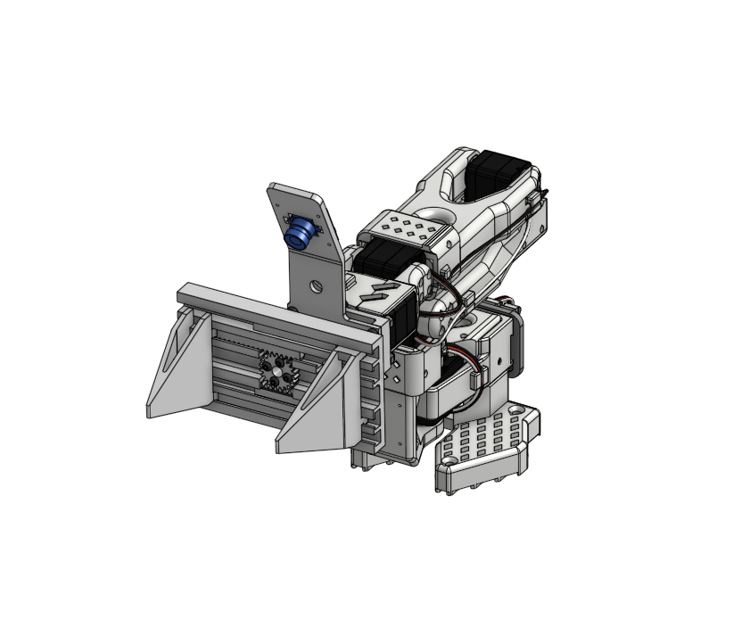
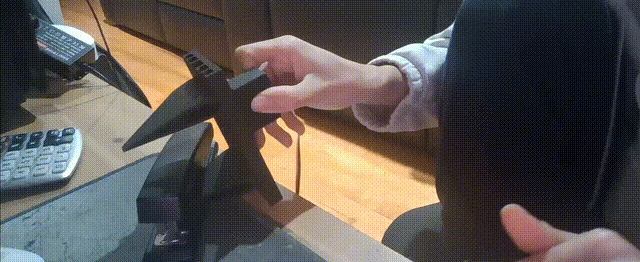

# SO-101 Parallel Gripper

A lightweight, fully 3D-printable rack-and-pinion gripper that gives the SO-101 arm an ALOHA-style parallel jaw with a 105 mm opening and 72 mm forward reach for real-world manipulation.

## Demo

*Watch the SO-101 Parallel Gripper in action*

## Specifications

- **Weight**: ~165 g
- **Opening Width**: 105 mm
- **Forward Reach**: 72 mm
- **Design**: Rack-and-pinion mechanism
- **Manufacturing**: Fully 3D-printable

## Assembly

View the full assembly instructions and CAD model here:
https://cad.onshape.com/documents/d1149295f86aada4af179739/w/6cb56f8acd609f12b3c3bfe1/e/1fb88de2f9833f29914e7cb3

## Files

- **STEP/**: CAD files in STEP format for editing and modification
- **STL/**: 3D-printable STL files ready for slicing

## Components

1. Backplate
2. Camera plate
3. Connector plate
4. Left gripper (rack)
5. Right gripper (rack)
6. Pinion gear

## Contact

- Discord: 221o7
- Email: grantgao221@gmail.com
